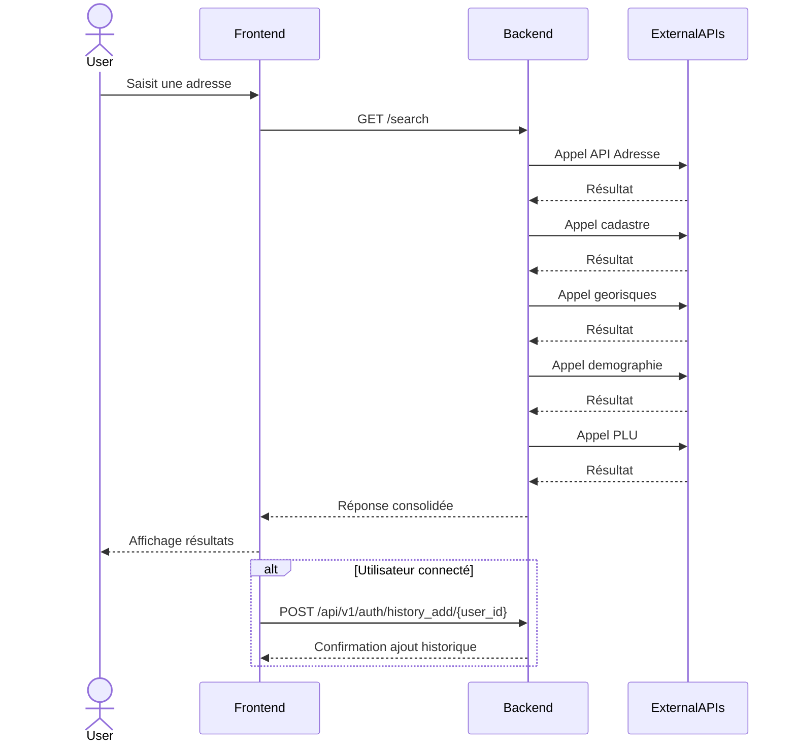
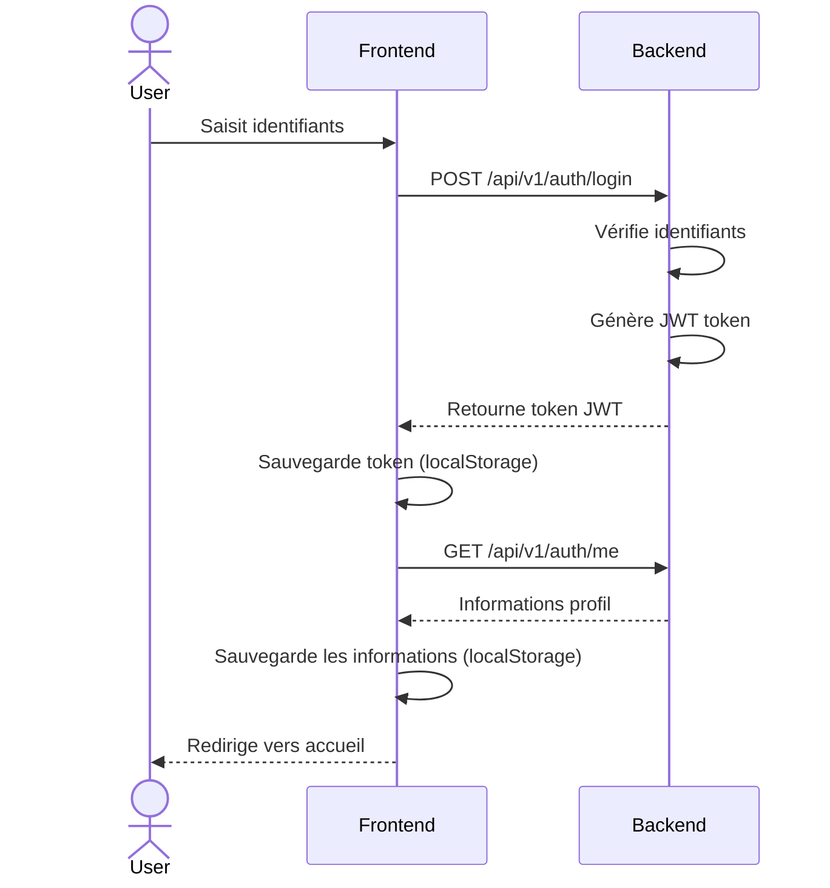
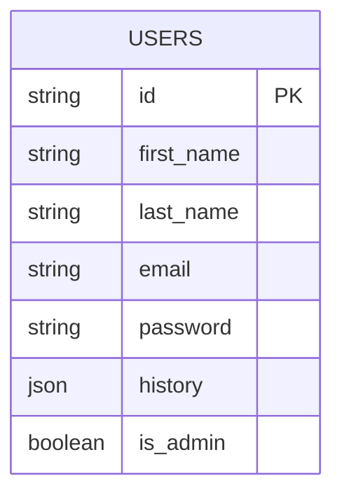
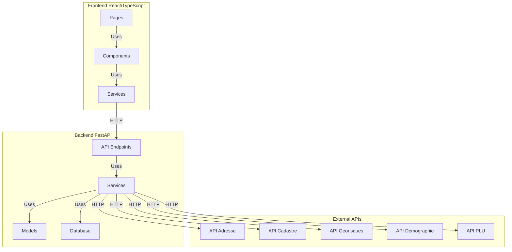

# InfoAdresse
Plateforme qui transforme une adresse en profil immobilier complet. Analyse le cadastre, PLU, géorisques et données locales. Développements futurs: analyse d'ensoleillement par IA et extraction intelligente de documents. Facilite l'accès aux données immobilières françaises.

## Instructions pour lancer le serveur

Pour faire fonctionner correctement l'application, vous devez suivre ces étapes :

1. **Ouvrir deux terminaux distincts**

2. **Dans le premier terminal :**
   - Naviguer vers le dossier backend
   - Exécuter la commande suivante :
   ```
   ./run.sh
   ```

3. **Dans le deuxième terminal :**
   - Naviguer vers le dossier frontend
   - Exécuter la commande suivante :
   ```
   yarn run dev --host
   ```

5. **Accéder à l'application :**
   - Ouvrir votre navigateur internet
   - Saisir l'adresse IP indiquée après "Network:" dans le terminal
   - L'application devrait maintenant être accessible

Assurez-vous que les deux terminaux restent ouverts pendant toute l'utilisation de l'application.


### Diagrammes :

1. **Diagramme de séquence pour la recherche d'adresse**




2. **Diagramme de séquence pour la connexion de l'utilisateur**



3. **Schéma de la base de données**



4. **Architecture globale**


